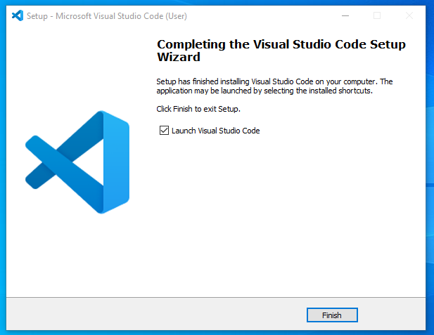
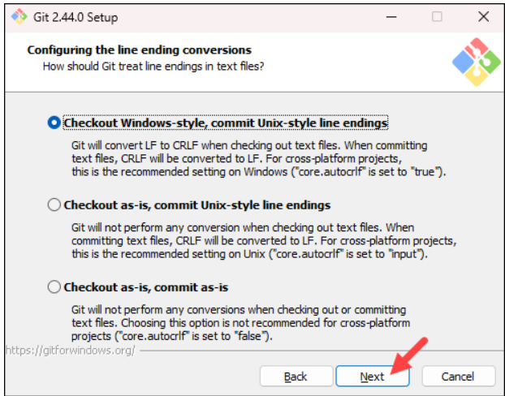

# Dev_Setup
Setup Development Environment

#Assignment: Setting Up Your Developer Environment

#Objective:
This assignment aims to familiarize you with the tools and configurations necessary to set up an efficient developer environment for software engineering projects. Completing this assignment will give you the skills required to set up a robust and productive workspace conducive to coding, debugging, version control, and collaboration.

#Tasks:

1. Select Your Operating System (OS):
   Choose an operating system that best suits your preferences and project requirements. Download and Install Windows 11. https://www.microsoft.com/software-download/windows11

Here are the summarized steps to install Windows 11:

Check Compatibility: Ensure your PC meets the minimum system requirements for Windows 11.
Backup Data: Back up important files to avoid data loss.
Create Installation Media: Use the Windows 11 Media Creation Tool to create a bootable USB drive.
Boot from USB: Restart your PC and boot from the USB drive.
Install Windows: Follow the on-screen prompts to select language, time, keyboard input, and install Windows 11.
Customize Settings: Choose privacy settings and customize your experience.
Sign In: Log in with your Microsoft account or create a new one.
Update Drivers: Ensure all device drivers are up to date for optimal performance.
Remember to keep your PC connected to power and the internet during installation.

2. Install a Text Editor or Integrated Development Environment (IDE):
   Select and install a text editor or IDE suitable for your programming languages and workflow. Download and Install Visual Studio Code. https://code.visualstudio.com/Download

Steps to Install Visual Studio Code on Windows
Step 1: Visit the Official Website of the Visual Studio Code using any web browser like Google Chrome, Microsoft Edge, etc.

Step 2: Press the “Download for Windows” button on the website to start the download of the Visual Studio Code Application.
Step 3: When the download finishes, then the Visual Studio Code Icon appears in the downloads folder.

Step 4: Click on the Installer icon to start the installation process of the Visual Studio Code.

Step 5: After the Installer opens, it will ask you to accept the terms and conditions of the Visual Studio Code. Click on I accept the agreement and then click the Next button.

Step 6: Choose the location data for running the Visual Studio Code. It will then ask you to browse the location. Then click on the Next button.

Step 7: Then it will ask to begin the installation setup. Click on the Install button.

Step 8: After clicking on Install, it will take about 1 minute to install the Visual Studio Code on your device.

Step 9: After the Installation setup for Visual Studio Code is finished, it will show a window like this below. Tick the “Launch Visual Studio Code” checkbox and then click Next.

Step 10: After the previous step, the Visual Studio Code window opens successfully.

3. Set Up Version Control System:
   Install Git and configure it on your local machine. Create a GitHub account for hosting your repositories. Initialize a Git repository for your project and make your first commit. https://github.com

Follow the steps below to install Git;
1. Navigate to the official Git downloads page and click the download link for the latest Git version for Windows:

2. Double-click the downloaded file to extract and launch the installer.

3. Review the GNU General Public License, and when you are ready to install, click Next.
4. The installer prompts you for an installation location. Leave the default one unless you want to change it, and click Next.
5. In the component selection screen, leave the defaults unless you need to change them and click Next.

6. The installer offers to create a start menu folder. Click Next to accept and proceed to the next step.

7. Select a text editor you want to use with Git
8. The next step allows you to choose a different name for your initial branch. The default is master. Unless you are working in a team that requires a different name, leave the default option and click Next.

9. The next step allows you to change the PATH environment. The PATH is the default set of directories included when you run a command from the command line. Keep the middle (recommended) selection and click Next.

10. The installer prompts you to select the SSH client for Git to use. Git already comes with its own SSH client, so if you don't need a specific one, leave the default option and click Next.

11. The next option relates to server certificatesSelect your preferred option and click Next.

12. The following selection configures line-ending conversion, which relates to the way data is formatted. The default selection is recommended for Windows. Click Next to proceed.

13. Choose the terminal emulator you want to use. The default MinTTY is recommended for its features. Click Next to continue.

14. The next step allows you to choose what the git pull command will do. The default option is recommended unless you specifically need to change its behavior. Click Next to continue with the installation.

15. The next step is to choose which credential helper to use. Git uses credential helpers to fetch or save credentials. The default option is the most stable one. Select your preferred credential manager and click Next.

16. The next step lets you decide which extra options to enable. If you use symbolic links, which represent shortcuts for the command line, tick the box. Keep file system caching checked and click Next.

17. Depending on which Git version you are installing, it may offer to install experimental features. At the time this article was written, the installer offered options to include support for pseudo controls and a built-in file system monitor. For the most stable operation, do not install experimental features and click Install.

18. Once the installation is complete, tick the boxes to view the Release Notes or launch Git Bash if you want to start using Git right away, and click Finish.

Steps to create a GitHub account for hosting your repositories include;
18..Visit https://github.com.
2.Click Sign up button.
3.Use email that has not been used for other GitHub account.
4.Type email address and click Continue.
5.Fill password and try until it says that Password is strong, then click Continue.
6.Enter a unique username and click Continue.
7.Choose option in receiving product updates and announcement via email, then click Continue.
8.Click Start puzzle to verify as a human and solve the puzzle.
9.Receive message that account is verified, then click Create account and check email for code from GitHub.
10.Enter emailed code and access the GitHub account.

Initialize a Git repository for your project and make your first commit.

First, make a testing folder on your local machine.

initialize a new git repo, run the following command in that folder;git init

Add a simple README.md file to our repository.

Run the commit command.

Add GitHub as a remote
Execute the following command you just got from GitHub. (Make sure this is your repo URL) ;git remote add origin git@github.com:rebelchris/git-test.git
Push git changes to GitHub

4. Install Necessary Programming Languages and Runtimes:
  Instal Python from http://wwww.python.org programming language required for your project and install their respective compilers, interpreters, or runtimes. Ensure you have the necessary tools to build and execute your code.

1.To download Python, you need to visit www.python.org, which is the official Python website.
2.Click on the Downloads tab and then select the Windows option. 
3.This will take you to the page where the different Python releases for Windows can be found. Since I am using a 64bit system, I’ll select “Windows x86-64 executable installer”.
4.Once the executable file download is complete, you can open it to install Python.
5.Click on Run, which will start the installation process.
6.Once the installation is complete, the below pop-up box will appear: Setup was successful.

5. Install Package Managers:
   If applicable, install package managers like pip (Python).

Step 1: Download PIP get-pip.py
Before installing PIP, download the get-pip.py file. Run the following cURL command in the command prompt:

Step 2: Installing PIP on Windows
To install PIP, run the following Python command:
Step 2: Installing PIP on Windows
To install PIP, run the following Python command:

Step 3: Verify Installation
To test whether the installation was successful, type the following command:

Step 4: Add Pip to Path
To run PIP from any location and as a standalone command, add it to Windows environment variables. Doing so resolves the "not on Path" error.
1. Open the Start menu, search for Environment Variables, and press Enter.

2. Click the Environment Variables button.

3. Double-click the Path variable to edit it.

4. Select New and add the directory where PIP is installed.

5. Click OK to save the changes.
6. Open a new command prompt session and run the following command to test the changes:

Step 5: Configuration
In Windows, the PIP configuration file can be found in several locations. To view the current configuration and list all possible file locations, use the following command:

6. Configure a Database (MySQL):
   Download and install MySQL database. https://dev.mysql.com/downloads/windows/installer/5.7.html
Steps for downloading include;
Step 1: Go to the official website of MySQL and download the community server edition software. Here, you will see the option to choose the Operating System, such as Windows.
Step 2: Next, there are two options available to download the setup. Choose the version number for the MySQL community server, which you want. If you have good internet connectivity, then choose the mysql-installer-web-community. Otherwise, choose the other one.

Steps for installation are as follows;
Step 1: After downloading the setup, unzip it anywhere and double click the MSI installer .exe file. It will give the following screen:

Step 2: In the next wizard, choose the Setup Type. There are several types available, and you need to choose the appropriate option to install MySQL product and features. Here, we are going to select the Full option and click on the Next button.

Step 3: Once we click on the Next button, it may give information about some features that may fail to install on your system due to a lack of requirements. We can resolve them by clicking on the Execute button that will install all requirements automatically or can skip them. Now, click on the Next button.

Step 4: In the next wizard, we will see a dialog box that asks for our confirmation of a few products not getting installed. Here, we have to click on the Yes button.After clicking on the Yes button, we will see the list of the products which are going to be installed. So, if we need all products, click on the Execute button.

Step 5: Once we click on the Execute button, it will download and install all the products. After completing the installation, click on the Next button.

Step 6: In the next wizard, we need to configure the MySQL Server and Router.

Step 7: As soon as you will click on the Next button, you can see the screen below. Here, we have to configure the MySQL Server. Now, choose the Standalone MySQL Server/Classic MySQL Replication option and click on Next. Here, you can also choose the InnoDB Cluster based on your needs.

Step 8: In the next screen, the system will ask you to choose the Config Type and other connectivity options. Here, we are going to select the Config Type as 'Development Machine' and Connectivity as TCP/IP, and Port Number is 3306, then click on Next.

Step 9: Now, select the Authentication Method and click on Next. Here, I am going to select the first option.

Step 10: The next screen will ask you to mention the MySQL Root Password. After filling the password details, click on the Next button.

Step 11: The next screen will ask you to configure the Windows Service to start the server. Keep the default setup and click on the Next button.

Step 12: In the next wizard, the system will ask you to apply the Server Configuration. If you agree with this configuration, click on the Execute button.

Step 13: Once the configuration has completed, you will get the screen below. Now, click on the Finish button to continue.

Step 14: In the next screen, you can see that the Product Configuration is completed. Keep the default setting and click on the Next-> Finish button to complete the MySQL package installation.

Step 15: In the next wizard, we can choose to configure the Router. So click on Next->Finish and then click the Next button.

Step 16: In the next wizard, we will see the Connect to Server option. Here, we have to mention the root password, which we had set in the previous steps.

Step 17: In the next wizard, select the applied configurations and click on the Execute button.

Step 18: After completing the above step, we will get the following screen. Here, click on the Finish button.

Step 19: Now, the MySQL installation is complete. Click on the Finish button.

7. Set Up Development Environments and Virtualization (Optional):
   Consider using virtualization tools like Docker or virtual machines to isolate project dependencies and ensure consistent environments across different machines.

8. Explore Extensions and Plugins:
   Explore available extensions, plugins, and add-ons for your chosen text editor or IDE to enhance functionality, such as syntax highlighting, linting, code formatting, and version control integration.

1.Syntax Highlighting and Language Support:
Programming Language Extensions:
VS Code has extensions for virtually every programming language, providing syntax highlighting and often additional features specific to that language (e.g., IntelliSense for autocompletion).
Example: "Python" for Python development, "JavaScript (ES6) code snippets" for JavaScript, etc.

2.Linting and Code Quality:
Linting Extensions:
Extensions like "ESLint" (for JavaScript), "pylint" (for Python), "flake8" (for Python), etc., provide real-time linting and code quality checks directly within VS Code.
These extensions help identify and fix syntax errors, style issues, and potential bugs.

3.Code Formatting:
Formatting Extensions:
Extensions such as "Prettier - Code formatter" and "ESLint" (with formatting capabilities) automatically format your code according to defined rules or style guides.
They ensure consistent code style across your project and can be customized based on your preferences.

4.Version Control Integration:
Git Integration:
VS Code has built-in Git support, but there are extensions that enhance its functionality:
GitLens: Provides rich Git capabilities including blame information, commit history, and comparison views.
GitHub Pull Requests and Issues: Allows you to manage GitHub pull requests and issues directly from VS Code.

6.Debugging:
Debugging Extensions:
VS Code supports debugging out of the box, but extensions like "Debugger for Chrome" (for debugging JavaScript in Chrome), "Python" (for Python debugging), etc., provide additional debugging features and integrations with external tools.

7.Productivity and Miscellaneous:
Productivity Extensions:
Bracket Pair Colorizer: Colorizes matching brackets to make code structure more readable.
Live Server: Launches a development server with live reload capability for web development.
Settings Sync: Syncs your VS Code settings across different machines using a GitHub gist.

8.Theme and UI Customization:
Theme Extensions:
VS Code supports various themes out of the box, but extensions like "Material Theme", "Dracula Official", "Monokai Pro", etc., offer more options for customizing the editor's appearance.
How to Install Extensions:
Open VS Code.
Go to the Extensions view by clicking on the Extensions icon in the Activity Bar on the side or using Ctrl+Shift+X.
Search for the desired extension using the search bar.
Click on "Install" next to the extension you want to install.

9. Document Your Setup:
    Create a comprehensive document outlining the steps you've taken to set up your developer environment. Include any configurations, customizations, or troubleshooting steps encountered during the process. 

Developer Environment Setup Guide

Introduction This document outlines the steps taken to set up a standard developer environment. It includes configurations, customizations, and troubleshooting steps commonly encountered during the process.

Step 1: Operating System Installation

Installed Windows 11 Professional.
Applied all available updates via Windows Update.
Step 2: Essential Software Installation

Installed web browsers (Google Chrome, Mozilla Firefox).
Installed productivity tools (Microsoft Office Suite, Adobe Reader).
Step 3: Development Tools Installation

Installed Visual Studio Code as the primary code editor.
Installed Git for version control.
Configured VS Code with essential extensions (e.g., Python, C/C++, Java).
Step 4: Programming Languages and Frameworks

Installed Python, Java, Node.js, and .NET Framework.
Set up environment variables for each language for command-line accessibility.
Step 5: Database Setup

Installed MySQL and MongoDB.
Configured local databases and set up initial user accounts.
Step 6: Customizations

Customized VS Code settings for preferred themes, font size, and keybindings.
Configured Git with global username and email.
Step 7: Troubleshooting

Encountered issues with Python PATH configuration. Resolved by manually adding Python scripts directory to the system PATH variable.
Faced permission issues with Git repositories. Fixed by adjusting folder permissions.
Conclusion The developer environment is now fully set up with all necessary tools and configurations. This setup enables efficient coding, debugging, version control management, and database operations.

 A GitHub repository containing a sample project initialized with Git and any necessary configuration files (e.g., .gitignore).

https://github.com/Roymbera/Taskmanager.git

References
https://www.javatpoint.com/how-to-install-mysql
https://dev.mysql.com/downloads/installer/
https://daily-dev-tips.com/posts/git-basics-your-first-commit-to-github/
https://www.simplilearn.com/tutorials/python-tutorial/python-installation-on-windows
https://binaryfork.com/how-to-install-windows-11-1114/

#Deliverables:
- Document detailing the setup process with step-by-step instructions and screenshots where necessary.
- A GitHub repository containing a sample project initialized with Git and any necessary configuration files (e.g., .gitignore).
https://github.com/Roymbera/Taskmanager.git

- A reflection on the challenges faced during setup and strategies employed to overcome them.

Challenge: Errors during tool installation (e.g., Git, VS Code) or issues with configuring paths and environment variables.
Strategy: Refer to installation guides and troubleshooting resources specific to your operating system. Verify dependencies and ensure you have administrative rights if needed.

Challenge: Configuring Git correctly (username, email, editor preferences) and setting up remote repositories (e.g., GitHub, GitLab) for collaboration.
Strategy: Follow step-by-step guides from Git hosting platforms. Double-check configurations using git config commands and test remote connections with git remote -v.

Challenge: Setting up and activating virtual environments (e.g., Python venv) correctly, managing dependencies, and ensuring compatibility.
Strategy: Refer to language-specific documentation for best practices. Use package managers (e.g., pip for Python) within the virtual environment to install dependencies isolated from system-wide packages.

Challenge: Learning Git commands, understanding version control concepts (like commits, branches, remotes), and configuring VS Code extensions can be overwhelming for beginners.
Strategy: Start with tutorials and documentation provided by Git and VS Code. Break down learning into manageable chunks, focusing on one concept or tool at a time.

#Submission:
Submit your document and GitHub repository link through the designated platform or email to the instructor by the specified deadline.

#Evaluation Criteria:**
- Completeness and accuracy of setup documentation.
- Effectiveness of version control implementation.
- Appropriateness of tools selected for the project requirements.
- Clarity of reflection on challenges and solutions encountered.
- Adherence to submission guidelines and deadlines.

Note: Feel free to reach out for clarification or assistance with any aspect of the assignment.
